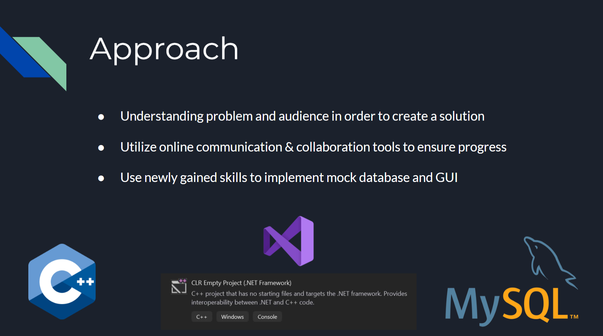

# ATM System

## Project Overview

This project is an ATM system developed to emulate the functionalities of a traditional Automatic Teller Machine. It allows users to interact with their bank accounts for tasks such as deposits, withdrawals, transfers, and viewing transaction history.

The system was created for **Purloin Bank** to:
- Provide a cost-effective and efficient customer interaction channel.
- Enable account access outside regular branch hours.
- Reduce foot traffic in branches and decrease wait times.

## Features

- **Login System**: Authenticate users with a card number and PIN.
- **Account Management**: Switch between checking and savings accounts.
- **Transactions**: Perform deposits, withdrawals, and transfers.
- **Balance Inquiry**: View account balances.
- **Transaction History**: Review past transactions for both deposits and withdrawals.

## Technical Details
- **Programming Language**: C++ with Visual Studio CLR.
- **Database**: MySQL for account data storage and retrieval.
- **GUI**: Interactive user interface for emulating ATM operations.

### Database Schema

The database consists of tables for storing account details, transactions, and user authentication data. Key components include:
- Accounts table: User account information.
- Transactions table: Logs of deposits, withdrawals, and transfers.

## Setup Instructions

1. **Clone the Repository**:
   ```bash
   git clone <repository_url>
   ```
2. **Set Up MySQL Database**:
   - Import the provided schema and data.
3. **Configure Database Connection**:
   - Update the `Constring` variable in the code with your database credentials.
4. **Build the Project**:
   - Open the solution in Visual Studio.
   - Build and run the project.

## Screenshots
Below are screenshots of the system's interface and functionality:

### Slides

1. **Problem Overview**
   

2. **Purloin Bank Benefits**
   

3. **Approach**
   

4. **Domain Model Diagram**
   

5. **Use Case Diagrams**
   

6. **Database Schema**
   

7. **MySQL Tables**
   
   

9-13. **Database Connection Code: Making a Deposit**
   
   
   
   
   

14. **GUI Walkthrough**
   

15. **Login Page**
   

16. **Account Selection**
    

17. **Main Menu**
    

18. **Transaction Pages**
    

19. **Check Balance Page**
    

20. **Transaction History Page**
    

21. **Difficulties Encountered**
    

22. **How We Resolved Our Difficulties**
    

23. **What We Learned**
    


## Authors
- Kevin Babakhani
- Emil Hovsepians
- Johnathan Driscoll
- Khaled Korfali
- Daniel Santamaria

